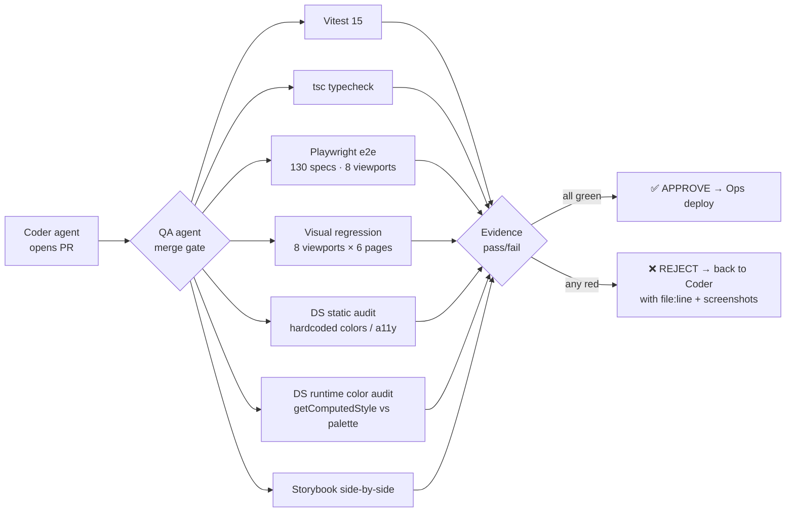

# agentic-qa-gate — an AI-agent merge gate built on Playwright

**▶ Live demo: https://pvom.github.io/agentic-qa-gate/** (open the app the gate audits)

> ⚠️ Sanitized portfolio sample. This documents a QA system running in production for
> **MedTrack** (a healthcare SaaS with 77 active users). Credentials, hosts, emails and
> proprietary code are removed; the demo runs on a throwaway app with synthetic data.
> This repo shows the **architecture and the techniques**, not the production codebase.

An automated **quality gate** where an AI agent operates a full Playwright + Vitest test
harness and **blocks any PR from reaching production** until it passes — including a
**runtime design-system compliance audit** that most test suites don't have.

No PR merges without the gate's approval. In production it protects **77 real users**.

---

## Why this is different from "just Playwright"

Most e2e suites check *behaviour*. This gate also enforces **visual and design-system
correctness at runtime**, and wraps everything in an **AI agent** that decides
approve/reject with evidence — not opinion.

Three layers:

1. **Behaviour** — 130 Playwright e2e specs (13 specs × 8 viewports = **1,104 runs**),
   15 Vitest unit tests, and a `tsc` typecheck.
2. **Visual regression** — Playwright screenshots across **8 viewports × 6 pages**
   (iPhone SE → iPad Pro → 1920 desktop), compared to a baseline, **mobile-first**.
3. **Design-System compliance (the standout)** — two complementary audits:
   - **Static audit** (shell): scans the diff for hardcoded colors (`bg-[#...]`),
     arbitrary spacing/radius (`p-[13px]`), non-canonical component imports, and
     accessibility violations (brand pink is background-only; text must use the
     WCAG-AAA accessible token). Exit code 1 on any violation, with `file:line`.
   - **Runtime color audit** (Playwright): navigates every route, reads the
     **computed color** (`getComputedStyle`) of every visible element, and compares it
     against an **authorized palette generated from the design system**. A "foreign
     color" = fail. This catches what static analysis can't — a token pointing to the
     wrong value, or a CSS variable overridden downstream.

The AI agent runs all of this, cross-checks components against Storybook, produces an
evidence-based verdict (`APPROVE / REJECT` with `X/130 pass` + screenshots), cleans up
its test data, and hands off to deploy.

---

## Architecture



The QA agent is one role in a small **multi-agent delivery pipeline**
(Coder → **QA gate** → Ops deploy). It has authority to approve/reject on its own;
only a human can override a rejection, and the rejection stays in the record.

---

## The runtime color audit (deep dive)

The novel piece. A dedicated spec walks the main routes, and for every visible element:

```ts
// pseudo-code of the core idea (sanitized)
const authorized = loadPalette('helpers/palette.json'); // generated from the design system
for (const el of visibleElements) {
  const c = getComputedStyle(el);                        // RENDERED color, not source
  for (const prop of ['color', 'background-color', 'border-color']) {
    const value = normalize(c[prop]);
    if (!authorized.has(value)) report(`${value}  ${prop}  ${selector(el)}`);
  }
}
// threshold: ≤ N foreign colors per route (calibrated to baseline)
// new violation vs previous HEAD → automatic REJECT
```

Because it reads the **computed** style in a real browser, it catches drift that never
shows up in source review: a design token silently resolving to the wrong hex, a global
CSS override, a third-party component injecting its own palette.

---

## What's in this sample repo

```
agentic-qa-gate/
├── README.md
├── demo-app/                  # tiny synthetic app (no client data) to run the gate against
├── e2e/
│   ├── ds-color-audit.spec.ts # runtime computed-color vs authorized palette
│   ├── visual-audit.spec.ts   # multi-viewport screenshots vs baseline
│   └── helpers/palette.json    # synthetic authorized palette
├── scripts/
│   └── ds-static-audit.sh     # static scan: hardcoded colors, a11y, arbitrary spacing
├── agent/
│   └── qa-role.md             # the QA agent's prompt/role (sanitized)
├── reports/
│   └── sample-qa-report.md    # example evidence-based verdict
└── .github/workflows/ci.yml   # runs the gate on every PR
```

## Run it

```bash
npm install
npm run demo         # start the synthetic demo app
npx playwright test  # behaviour + visual + runtime color audit
bash scripts/ds-static-audit.sh   # static DS/a11y scan (exit 1 on violation)
```

## Results (production, MedTrack)

- **1,104** e2e runs green before any deploy · **0** design-system regressions shipped
- Mobile-first gate for a product whose users are **77 physicians on their phones**
- Every merge carries an auditable report: `Vitest X/15 · Playwright X/130 · foreign colors ≤ N`

## Stack

Playwright · Vitest · TypeScript · shell · GitHub Actions · an LLM agent (role-based) as the orchestrator/decider.

## Notes on sanitization

Removed from the public sample: the test account & credentials, VPS host/SSH keys,
Supabase project, real design-system palette, and all client data. The demo uses a
synthetic app + synthetic palette so the **technique** is reproducible without exposing
anything from production.
